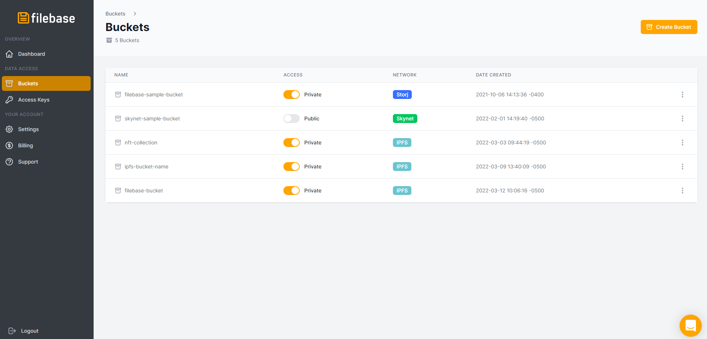

Decentralized storage offers a different way of thinking about how to store and access your information. In this model, data is distributed across nodes that are geographically distributed and connected through a peer-to-peer network. This is very different from a traditional cloud model where data is siloed into regions that are prone to outages, and failure. By contrast, peer-to-peer networks are resilient to catastrophic events such as natural disasters, fires, or infrastructure compromise.

[Filebase](https://filebase.com/) is the world’s first object storage platform powered by decentralized storage networks, unifying multiple networks under a single S3-compatible API to make decentralized storage accessible and easy to use. Its proprietary edge-caching technology achieves industry-leading performance when writing and fetching data to and from Web3, making it a highly-secure, geo-redundant alternative to traditional cloud storage at a fraction of the costs.

## **The Story of Filebase**

CEO Joshua Noble and COO Zac Cohen both come from backgrounds in the cloud computing world. In their careers, they had been exposed to AWS and the cost of centralized cloud storage, despite the weaknesses that the centralized cloud faces, such as security holes and crippling outages.

In 2019, they co-founded Filebase with the vision of unifying multiple networks under a single S3-compatible API to make decentralized storage simple, accessible, and as easy to use as Amazon. By building a bridge that makes it possible for anyone to leverage the unique qualities of decentralized networks, Filebase is an easy on-ramp (Layer-2) for users of all skill levels and knowledge backgrounds to be able to utilize and build with blockchain-based solutions.

Filebase has put in years of steady work to simplify all of the complexities of blockchains and cryptocurrency to make an object storage platform that is as familiar as Amazon S3, but with a completely different type of backend architecture. It manages all aspects of the data storage layer on behalf of its users such as minimum file or sector sizes, data retention issues, or requiring special software, skill sets and tokens required to utilize decentralized networks.

## **IPFS Pinning Services**

Within the IPFS ecosystem, there are a variety of public gateways available for uploading files, but due to the IPFS garbage collection process, unless a file is explicitly pinned it will be removed the next time the garbage collection process runs. To solve this problem, numerous pinning services have emerged.

## **Bridging the Gaps**

Filebase spent a lot of time researching and analyzing these other pinning services. Since its flagship S3-compatible API has processed over 1 billion files through the platform, the project started engineering work around how to offer a dramatically different type of IPFS pinning service. Here is what it found:

* Most IPFS pinning providers use Amazon S3 and other Web2 centralized object storage services under the hood. The "data store" of an IPFS server can be pointed to S3 using a simple plugin.
* Because AWS S3 is being used, providers are charging upwards of \~$150 per TB.
* If AWS goes down, IPFS servers go down too. Unless the data has been cached somewhere, user’s IPFS CID links are no longer accessible.

## **Building Web3 with Web3 - IPFS Implementation**

Filebase is excited to share that it now supports IPFS with a proprietary feature that makes its IPFS pinning service unique. Files that are pinned onto IPFS using Filebase are actually being stored on Sia, one of the leading decentralized storage networks. This creates an environment where the data storage layer for Filebase IPFS nodes is highly available, and most importantly, geo-redundant by default. A Filebase edge location could suffer a complete outage, and other locations will simply pick up the slack. This is made possible because the underlying data storage layer is decentralized.

There's a massive cost benefit too; this is available to all Filebase users for $5.99 per TB while the integration remains in the beta stage. This is a significantly reduced cost compared to other pinning services today, charging \~$100-$150 per TB.

## **What’s Next for Filebase**

Filebase has a variety of upcoming developments and features planned, including:

* Bucket level access keys: Users will be able to create a pair of access keys specific to individual buckets, in addition to their account’s root level access key pair that can access all buckets on the account.
* Folder level IPFS CIDs: Users will be able to upload folders on IPFS and reference objects in those folders using the IPFS CID of the folder and the object’s key.

## **Learn More**

[Sign up](https://filebase.com/signup) at no cost, or check out the[ Filebase documentation](https://docs.filebase.com/) for a variety of tool configuration guides, code development documentation, and deep dives on different Web3 topics such as Geo-redundancy and NFTs.

For questions, find them on Twitter[ @Filebase](https://twitter.com/filebase), send Filebase an email at hello@filebase.com, or join their community[ Discord server.](https://discord.gg/xuX96JmChR)